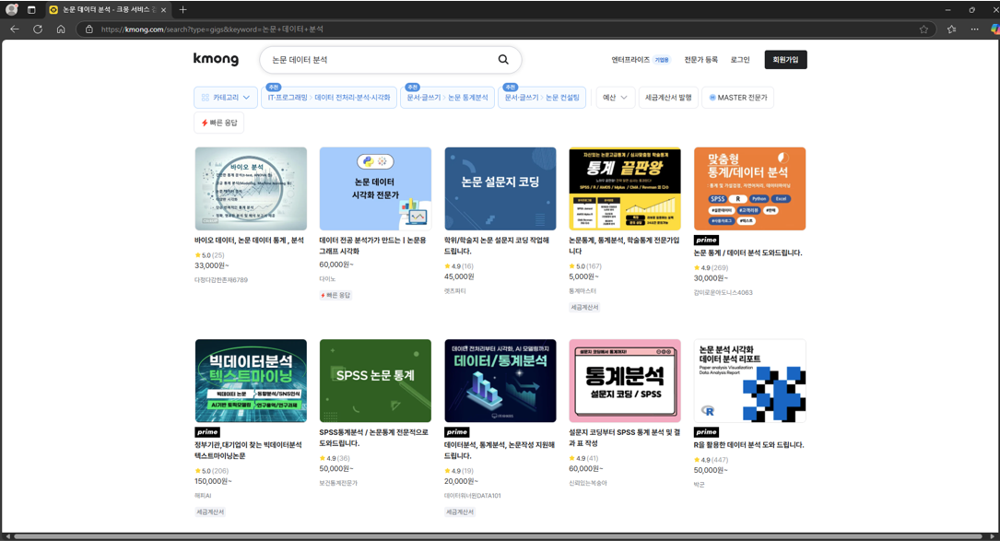
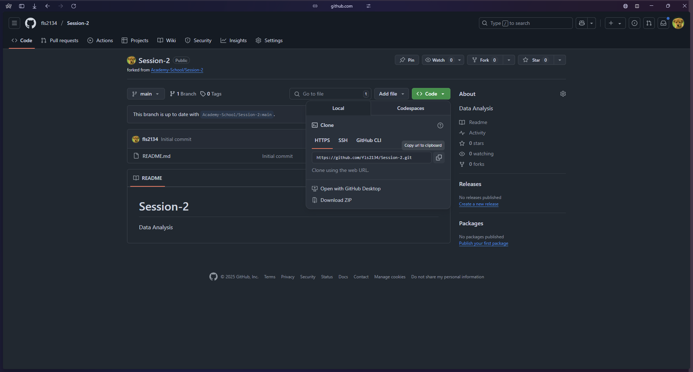
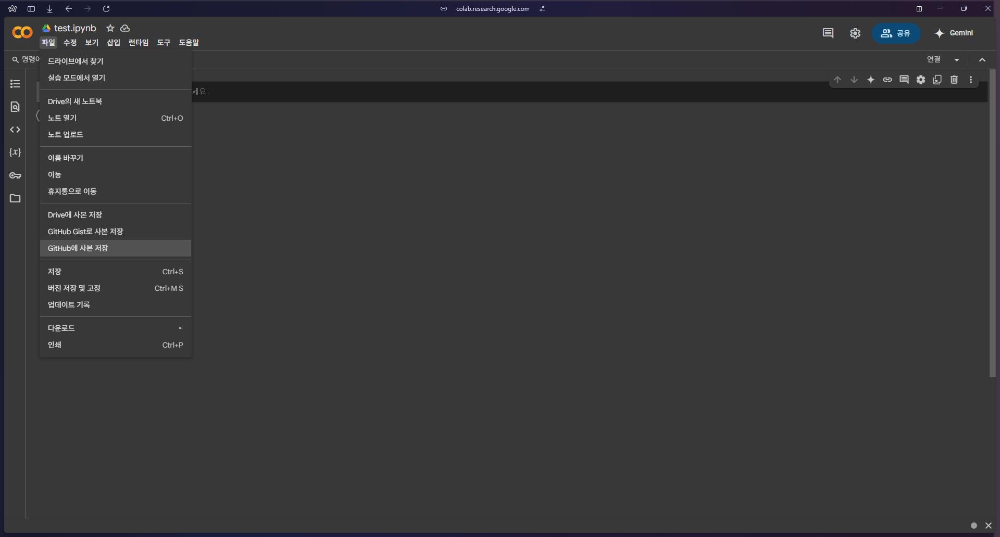
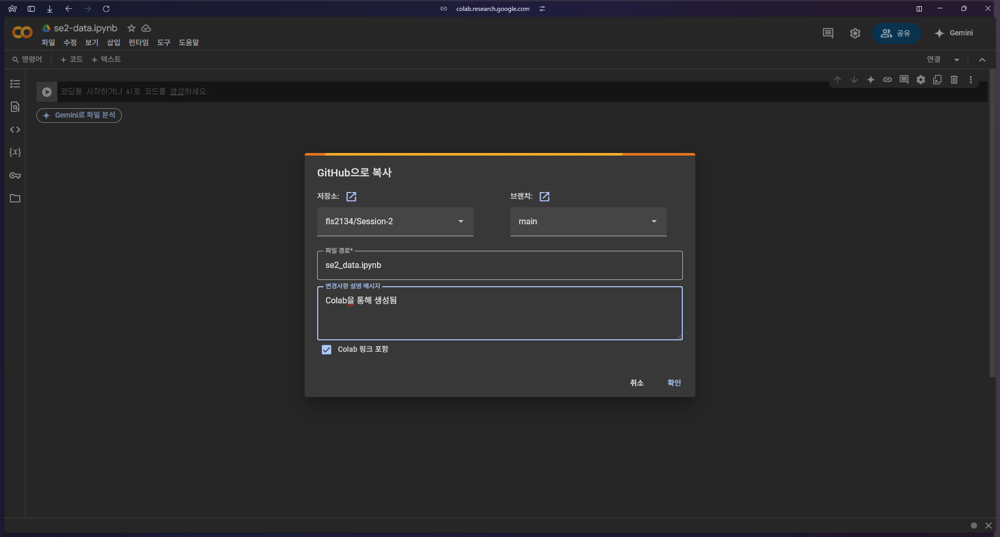
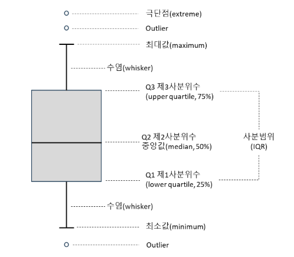
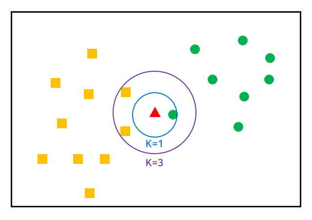
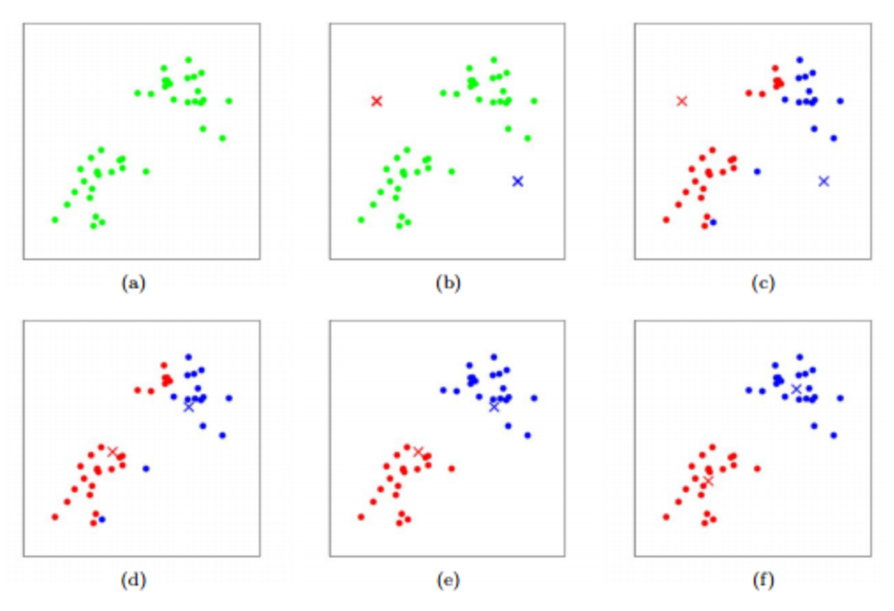
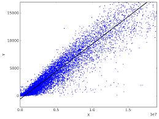
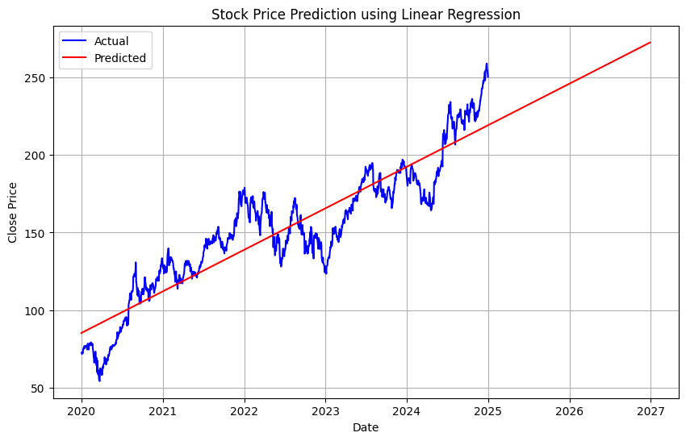

# 2주차

## 데이터 분석과 수치 해석

---

# AI 개요

- **AI** : 인간의 학습, 추론, 문제 해결 능력을 모방하는 모든 기술을 포함
- ✅ **ML** : 데이터를 학습하여 패턴을 찾아 예측하는 알고리즘
- **DL** : 인공신경망(Neural Network)을 이용해 데이터 학습

```
딥러닝 ⊂ 머신러닝 ⊂ 인공지능
```

---

# ML과 DL 구분

| 구분              | 머신러닝 (Machine Learning)                          | 딥러닝 (Deep Learning)                          |
| ----------------- | ---------------------------------------------------- | ----------------------------------------------- |
| **정의**          | 데이터를 기반으로 학습하는 AI 기법                   | 신경망(Neural Network) 기반의 학습              |
| **특징**          | 데이터에서 패턴을 찾아 예측                          | 다층 신경망을 사용하여 자동으로 특징 추출       |
| **데이터 의존성** | ↓                                                    | ↑                                               |
| **학습 속도**     | 빠름                                                 | 느림                                            |
| **모델 예시**     | SVM, 랜덤 포레스트, KNN, 선형 회귀, 로지스틱 회귀 등 | CNN, RNN, LSTM, GAN, Transformer 등             |
| **응용 분야**     | 추천 시스템, 질병 예측, 금융 모델링                  | 이미지 인식, 음성 인식, 자율주행, 번역, 생성 AI |

---

# Neural Network


---

# 인공지능 학습(신경망)과정의 개요


---

# 지도 & 비지도 학습 구분

GAN이나 강화학습 등 DL임에도 지도학습이 아닌 경우 존재

| 구분            | 지도학습 (Supervised Learning)                                          | 비지도학습 (Unsupervised Learning)                 |
| --------------- | ----------------------------------------------------------------------- | -------------------------------------------------- |
| **정의**        | 정답(라벨)이 있는 데이터를 학습                                         | 정답(라벨) 없이 데이터를 학습                      |
| **목적**        | 입력 데이터를 보고 정답을 예측                                          | 데이터의 숨겨진 패턴을 찾음                        |
| **입력 데이터** | (입력값, 정답) 쌍이 존재                                                | 입력값만 존재 (정답 없음)                          |
| **출력 값**     | 특정 라벨(분류) 또는 수치 값(회귀) 예측                                 | 그룹(클러스터) 할당 또는 패턴 발견                 |
| **대표 모델**   | KNN, SVM, 결정 트리, 랜덤 포레스트, 선형 회귀, 로지스틱 회귀, 신경망 등 | K-Means, DBSCAN, PCA, 군집 분석, 연관 규칙 분석 등 |
| **예제**        | 스팸 메일 분류, 손글씨 숫자 인식, 가격 예측                             | 고객 세분화, 이상 탐지, 추천 시스템                |

---

# 결론

```
✅ 확률 + 기하
```


---

# Data Analysis

## ML을 위한 데이터 분석과 수치해석

---

# 데이터 분석 수요



---

# 목차

<hr/>

1. ML의 4대 주요 목적
2. 데이터 수치화 & 시각화 대표 라이브러리
3. 분류
4. 클러스터링(군집화)
5. 예측

---

<style scoped>section{text-align: center;}</style>

# ML의 4대 주요 목적

<br/>

## 예측, 분류, 군집화, 차원축소

---

# ML의 4대 주요 목적(1) - 예측

## `연속적 데이터에 대한 예측`

###### 예시

- 주가 예측
- 날씨 예측
- 판매량 예측

###### 대표 모델

- 선형 회귀 (Linear Regression)
- 랜덤 포레스트
- RNN, LSTM (시계열 데이터)

---

# ML의 4대 주요 목적(2) - 분류

## `주로 True / False에 대한 분류`

###### 예시

- 이미지 구분
- 의료 진단

###### 대표 모델

- KNN (K-Nearest Neighbors)
- SVM (Support Vector Machine)
- CNN (Convolutional Neural Network)

---

# ML의 4대 주요 목적(3) - 군집화

## `비슷한 데이터끼리 군집화`

###### 예시

- 고객 세분화
- 뉴스 기사 자동 분류
- 이상 탐지

###### 대표 모델

- K-Means
- DBSCAN
- 계층적 군집화

---

# ML의 4대 주요 목적(4) - 차원 축소

## `데이터에서 관심 특징 추출`

###### 예시

- 데이터 시각화
- 노이즈 제거

###### 대표 모델

- PCA (Principal Component Analysis)
- t-SNE (t-Distributed Stochastic Neighbor Embedding)

---

<style scoped>section{text-align: center;}</style>

# 데이터 수치화 & 시각화 대표 라이브러리

<br/>

## Numpy, Pandas, Matplotlib

---

# 데이터 수치화 & 시각화 대표 라이브러리(1)

## `Numpy`

다차원 배열(Matrix)의 빠른 연산

**✅ 활용 분야**

- 행렬 연산
- 데이터 전처리
- 통계 분석

---

# 데이터 수치화 & 시각화 대표 라이브러리(2)

## `Pandas`

데이터에 대한 표 형식의 표현

**✅ 활용 분야**

- 데이터 분석 (ex. 고객 데이터 분석)
- 데이터 정제 및 변환
- 머신러닝 데이터 준비

---

# 데이터 수치화 & 시각화 대표 라이브러리(3)

## `Matplotlib`

데이터 그래프 시각화 처리

**✅ 활용 분야**

- 분석 시각화
- AI 학습 시 과정 시각화
- 통계 데이터 표현

---

# 실습 전 준비

1. Github Repo Fork
2. Repo URL Clone



---

3. Colab 접속 및 주소 연동 `저장소 이름 확인!`


---

4. Create File
5. 코드 작성

```py
# write your code

"""
Lorem Ipsum is simply dummy text of the printing and typesetting industry.
Lorem Ipsum has been the industry's standard dummy text ever since the 1500s
when an unknown printer took a galley of type and scrambled it to make a type specimen book
"""

print("Hello World!")

```

---

6. 작업 내용 저장



---

7. github 연동 `저장소 이름 확인!`



---

8. 승인


---

# 🏷️ Numpy 기본 사용(1)

```py
import numpy as np

# NumPy 배열 생성 (기본적인 리스트 변환)
arr = np.array([1, 2, 3, 4, 5])
print("1D 배열:", arr)

# 2차원 배열 (행렬) 생성
matrix = np.array([[1, 2, 3], [4, 5, 6]])
print("2D 배열:\n", matrix)

# 배열의 기본 정보 확인
print("배열 크기:", matrix.shape)  # (2,3) → 2행 3열
print("배열 차원:", matrix.ndim)   # 2차원 배열
print("배열 데이터 타입:", matrix.dtype)  # int64 (or int32)
```

---

# 🏷️ Numpy 기본 사용(2)

```py
# 난수 생성
random_arr = np.random.rand(3, 3)  # 3x3 랜덤 행렬 (0~1 사이 값)
print("랜덤 배열:\n", random_arr)

# 기본 연산 (벡터 연산 가능)
a = np.array([10, 20, 30])
b = np.array([1, 2, 3])

print("덧셈:", a + b)  # [11 22 33]
print("곱셈:", a * b)  # [10 40 90]
```

---

# 🏷️ Numpy 기본 사용(3)

```py
# 행렬 곱셈 (dot product)
A = np.array([[1, 2], [3, 4]])
B = np.array([[5, 6], [7, 8]])

print("행렬 곱 (A @ B):\n", A @ B)  # 또는 np.dot(A, B)

# 통계 연산
data = np.array([10, 20, 30, 40, 50])
print("평균:", np.mean(data))  # 30.0
print("표준편차:", np.std(data))  # 14.14
print("최댓값:", np.max(data))  # 50
print("최솟값:", np.min(data))  # 10
```

---

# 🏠 Pandas 기본 사용(1)

```py
import pandas as pd  # Pandas 라이브러리 불러오기

# 1️⃣ 데이터프레임(DataFrame) 생성
data = {
    'Name': ['Alice', 'Bob', 'Charlie'],
    'Age': [25, 30, 35],
    'Score': [85, 90, 95]
}
df = pd.DataFrame(data)

print("📌 데이터프레임 출력:")
print(df)
```

---

# 🏠 Pandas 기본 사용(2)

```py

# 2️⃣ 데이터프레임 기본 정보 확인
print("\n📌 데이터프레임 정보:")
print(df.info())  # 데이터 타입, 결측치 확인

print("\n📌 데이터프레임 통계 요약:")
print(df.describe())  # 평균, 표준편차, 최소/최대값 등

# 3️⃣ 특정 열 선택
print("\n📌 'Name' 열만 선택:")
print(df['Name'])
```

---

# 🏠 Pandas 기본 사용(3)

```py

# 4️⃣ 특정 행 선택 (iloc: 인덱스 기준, loc: 이름 기준)
print("\n📌 첫 번째 행 선택 (iloc 사용):")
print(df.iloc[0])  # 첫 번째 행

print("\n📌 'Bob'이 포함된 행 선택 (loc 사용):")
print(df.loc[df['Name'] == 'Bob'])

# 5️⃣ 새로운 열 추가
df['Passed'] = df['Score'] > 88  # 88점 이상이면 True
print("\n📌 'Passed' 열 추가:")
print(df)
```

---

# 🏠 Pandas 기본 사용(4)

```py
# 6️⃣ 평균 나이 계산
print("\n📌 평균 나이:", df['Age'].mean())

# 7️⃣ 데이터 정렬 (Score 기준 내림차순)
df_sorted = df.sort_values(by='Score', ascending=False)
print("\n📌 점수 내림차순 정렬:")
print(df_sorted)

# 8️⃣ CSV 파일 저장 및 불러오기 (실제 사용 예)
# df.to_csv("data.csv", index=False)  # 저장
# df = pd.read_csv("data.csv")  # 불러오기
```

---

# 🎇 matplotlib 기본 사용(1)

```py
import matplotlib.pyplot as plt
import numpy as np

# 선 그래프 (Line Plot)
x = np.linspace(0, 10, 100)
y = np.sin(x)
plt.plot(x, y, label="sin(x)", color="b", linestyle="--")
plt.title("Sinusoidal Wave")
plt.xlabel("X-axis")
plt.ylabel("Y-axis")
plt.legend()
plt.grid(True)
plt.show()
```

---

# 🎇 matplotlib 기본 사용(2)

```py
# 막대 그래프 (Bar Chart)
categories = ["A", "B", "C", "D"]
values = [10, 20, 15, 30]
plt.bar(categories, values, color=['red', 'blue', 'green', 'purple'])
plt.title("Bar Chart Example")
plt.xlabel("Categories")
plt.ylabel("Values")
plt.show()
```

---

# 🎇 matplotlib 기본 사용(3)

```py
# 산점도 (Scatter Plot)
np.random.seed(0)
x = np.random.rand(50)
y = np.random.rand(50)
colors = np.random.rand(50)
plt.scatter(x, y, c=colors, cmap='viridis', alpha=0.7, edgecolors="black")
plt.title("Scatter Plot Example")
plt.xlabel("X-axis")
plt.ylabel("Y-axis")
plt.colorbar(label="Color Intensity")
plt.show()
```

---

# 🎇 matplotlib 기본 사용(4)

```py
# 히스토그램 (Histogram)
data = np.random.randn(1000)
plt.hist(data, bins=30, color="skyblue", edgecolor="black")
plt.title("Histogram Example")
plt.xlabel("Value")
plt.ylabel("Frequency")
plt.show()
```

---

# 간단한 예제(Boxplot)

```py
import matplotlib.pyplot as plt
import numpy as np

np.random.seed(10)
data = np.random.randn(50) * 10  # 평균 0, 표준편차 10을 따르는 정규분포 데이터
data = np.append(data, [50, -40])  # 이상치 추가

# 박스플롯 그리기 (이상치 표시)
plt.boxplot(data)

# 제목 및 라벨 추가
plt.title("Box Plot with Outliers")
plt.ylabel("Value")
plt.show()
```

---

# Boxplot 해석법

| 용어                 | 설명                                                                                           |
| -------------------- | ---------------------------------------------------------------------------------------------- |
| **최솟값 (minimum)** | 제1사분위에서 1.5 IQR을 뺀 위치                                                                |
| **제1사분위수 (Q1)** | 상자의 아랫면으로 25% 위치를 의미                                                              |
| **제2사분위수 (Q2)** | 상자의 내부 선으로 표현하는 중앙값(median)으로 50%의 위치를 의미                               |
| **제3사분위수 (Q3)** | 상자의 윗면으로 75% 위치를 의미                                                                |
| **최댓값 (maximum)** | 제3사분위에서 1.5 IQR을 더한 위치                                                              |
| **사분 범위 (IQR)**  | Q1 ~ Q3까지 범위를 의미                                                                        |
| **수염 (whisker)**   | 데이터의 범위를 표시하기 위해 상자 가장자리에서 수염이 뻗어 있음                               |
| **이상점 (outlier)** | 최대값과 최솟값을 넘어가는 위치를 의미, 이상값(존재하는 경우)은 수염 너머에 있는 데이터 포인트 |

---

# Boxplot 해석법



---

# Iris 데이터셋

붓꽃(iris flower)품종 데이터셋. 통계학자 Ronald Fisher가 1936년에 소개했으며, 머신러닝 및 데이터 분석에서 테스트를 목적으로 하는 대표적인 데이터셋이다.

|     | sepal length (cm) | sepal width (cm) | petal length (cm) | petal width (cm) | species |
| --- | ----------------- | ---------------- | ----------------- | ---------------- | ------- |
| 0   | 5.1               | 3.5              | 1.4               | 0.2              | setosa  |
| 1   | 4.9               | 3.0              | 1.4               | 0.2              | setosa  |
| 2   | 4.7               | 3.2              | 1.3               | 0.2              | setosa  |
| 3   | 4.6               | 3.1              | 1.5               | 0.2              | setosa  |
| 4   | 5.0               | 3.6              | 1.4               | 0.2              | setosa  |

---

# Iris 데이터셋 불러오기

```py
from sklearn.datasets import load_iris
import pandas as pd

# 아이리스 데이터셋 불러오기
iris = load_iris()

# 데이터프레임으로 변환
df = pd.DataFrame(iris.data, columns=iris.feature_names)
df['species'] = iris.target  # 품종 추가
df['species'] = df['species'].map({0: 'setosa', 1: 'versicolor', 2: 'virginica'})  # 라벨을 품종 이름으로 변환

# 데이터 확인
df.head(5)
```

---

<style scoped>section{text-align: center;}</style>

# 분류

<br/>

## K-Nearest Neighbors, KNN

---

# KNN

`최근접 이웃(K-Nearest Neighbors, KNN) 알고리즘`

**KNN 알고리즘**

1. 새로운 데이터 포인트가 주어지면, 기존 데이터에서 가장 가까운 K개의 데이터 포인트를 찾는다.
2. 찾은 K개의 데이터 중 가장 많이 등장한 클래스(품종)를 선택하여 새로운 데이터의 클래스로 결정한다.
3. K의 값이 작을수록(예: K=1), 개별 데이터에 영향을 많이 받고, 클수록(예: K=10) 전체적인 경향을 따르게 된다.

---

# KNN



---

# KNN

```py
# 필요한 라이브러리 불러오기
import numpy as np
import pandas as pd
import matplotlib.pyplot as plt
from sklearn.datasets import load_iris
from sklearn.model_selection import train_test_split
from sklearn.preprocessing import StandardScaler
from sklearn.neighbors import KNeighborsClassifier
from sklearn.metrics import accuracy_score
```

---

# KNN

```py
# 1️⃣ 아이리스 데이터 로드
iris = load_iris() # 150개
X = iris.data  # 특징 데이터 (꽃받침, 꽃잎의 길이와 너비)
y = iris.target  # 품종 (0: Setosa, 1: Versicolor, 2: Virginica)

# 2️⃣ 데이터 분할 (훈련 데이터 80%, 테스트 데이터 20%)
X_train, X_test, y_train, y_test = train_test_split(X, y, test_size=0.2, random_state=42)

# 3️⃣ 데이터 스케일링 (KNN은 거리 기반 알고리즘이므로 정규화 필수)
scaler = StandardScaler()
X_train = scaler.fit_transform(X_train)
X_test = scaler.transform(X_test)

# 4️⃣ KNN 모델 학습 (K=5)
knn = KNeighborsClassifier(n_neighbors=5)
knn.fit(X_train, y_train)
```

---

# KNN

```py
# 5️⃣ 예측 및 평가
y_pred = knn.predict(X_test)
accuracy = accuracy_score(y_test, y_pred)
print(f"KNN 정확도: {accuracy:.4f}")

# 6️⃣ 샘플 데이터 예측 (새로운 붓꽃 데이터 입력)
new_sample = np.array([[5.1, 3.5, 1.4, 0.2]])  # Setosa와 유사한 데이터
new_sample_scaled = scaler.transform(new_sample)
predicted_class = knn.predict(new_sample_scaled)
print(f"예측된 품종: {iris.target_names[predicted_class][0]}")

```

---

KNN은 비지도 학습 아니었음?

`데이터 스케일과 학습 과정의 필요성`

거리 계산에서 각 특징(feature)의 단위나 범위가 다르면, 큰 값을 가진 특성이 거리 계산에 더 큰 영향을 미친다. 예를 들어, 하나의 특성은 `0`~`1` 범위이고 다른 특성은 `1,000`~`10,000` 범위일 경우, 거리는 두 번째 특성에 더 크게 영향을 받을 수 있기에 정규화를 하고 그에 따른 적합한 예측 모델을 만드는 것.

**예시**

특성 1: 꽃받침의 길이 (cm) → 0~10 범위
특성 2: 꽃잎의 너비 (cm) → 0~5 범위

---

#### 데이터 스케일링 공식

스케일링을 하는 방법은 여러 가지가 있지만 가장 흔하게 사용되는 방법은 **표준화(Standardization)**. 데이터를 평균 0, 표준편차 1로 변환하여 스케일링을 진행하며, 모든 특성이 동일한 범위에 들어가 데이터 간 영향력의 균형을 맞춘다.

**표준화 (Standardization)**

$$Z = \frac{X - \mu}{\sigma} $$

- `X`: 원본 데이터
- `μ`: 평균
- `𝜎`: 표준편차

---

#### 거리 계산(유클리드 거리)

N차원으로 일반화된 데이터에 대해 두 점 P1(x_1, x_2, ..., x_n)과 P2(y_1, y_2, ..., y_n) 사이의 거리

**2차원**

$$d(P_1, P_2) = \sqrt{(x_1 - x_2)^2 + (y_1 - y_2)^2}$$

**N차원**

$$d(P_1, P_2) = \sqrt{\sum_{i=1}^{n} (x_{i} - y_{i})^2}$$

---

<style scoped>section{text-align: center;}</style>

# 군집화

<br/>

## K-means 알고리즘

---

# K-means

`K-means 알고리즘`

**K-means 알고리즘**

1. 주어진 데이터셋에서 K개의 군집을 찾는 알고리즘.
2. 처음 K개의 중심점을 랜덤으로 선택하고, 각 데이터 포인트를 가장 가까운 중심점에 할당.
3. 각 군집에 속하는 데이터 포인트들의 평균을 계산하여 새로운 중심점을 갱신.
4. 군집 중심점이 더 이상 변하지 않거나 `일정 기준을 만족할 때`까지 2단계와 3단계를 반복.

---

# K-means



---

# K-means

```py
from sklearn import datasets
from sklearn.cluster import KMeans
import matplotlib.pyplot as plt

# 1️⃣ 아이리스 데이터셋 로드
iris = datasets.load_iris()

# 2️⃣ 꽃잎의 길이와 너비 특성만 추출
X = iris.data[:, 2:]  # 꽃잎 길이와 꽃잎 너비
y = iris.target  # 실제 품종 정보
```

---

# K-Means

```py
# 3️⃣ K-Means 클러스터링 모델 생성 (3개의 클러스터로 설정)
kmeans = KMeans(n_clusters=3, random_state=21)  # n_clusters=3은 3개의 군집으로 분할
kmeans.fit(X)  # KMeans 모델 학습

# 4️⃣ 예측된 클러스터 레이블
y_pred = kmeans.labels_  # KMeans 알고리즘이 예측한 클러스터 레이블

# 5️⃣ 군집의 중심점 추출
centers = kmeans.cluster_centers_  # 군집 중심점

# 6️⃣ 실제와 KMeans 예측 결과 비교 그래프 생성
fig, axes = plt.subplots(1, 2, figsize=(7, 3))  # 두 개의 서브 플롯
```

---

# K-Means

```py
# 7️⃣ 실제 아이리스 데이터 산점도
axes[0].scatter(X[:, 0], X[:, 1], c=y, cmap='Set1_r', s=10)  # 실제 품종 레이블에 따른 색상
axes[0].set_xlabel('Petal length')  # x축 라벨
axes[0].set_ylabel('Petal width')  # y축 라벨
axes[0].set_title('Actual')  # 제목: 실제 값

# 8️⃣ K-Means 예측 결과 산점도
axes[1].scatter(X[:, 0], X[:, 1], c=y_pred, cmap='Set1', s=10)  # KMeans 예측값에 따른 색상
axes[1].set_xlabel('Petal length')  # x축 라벨
axes[1].set_ylabel('Petal width')  # y축 라벨
axes[1].set_title('Predicted')  # 제목: KMeans 예측 값
```

---

# K-Means

```py
# 9️⃣ 군집의 중심점 표시
axes[1].scatter(centers[:, 0], centers[:, 1], c='blue', marker='x', s=50, label='Centroids')  # 군집 중심점
axes[1].legend()  # 범례 표시

# 10️⃣ 그래프 출력
plt.tight_layout()  # 그래프 간격 조정
plt.show()
```

---

# 관련 공식

1. K-means에서 데이터 포인트 x와 중심점 c간의 거리는 **유클리드 거리**로 계산.

2. 각 데이터 포인트`x_i`는 가장 가까운 클러스터 중심 `c_k`로 할당. 각 데이터 포인트와 모든 클러스터 중심 사이의 거리를 계산 후 최소 거리를 가진 클러스터를 선택.

$$
y_i = \underset{k}{\arg \min} \, d(x_i, c_k)
$$

3. 각 클러스터의 중심점 `c_k`는 해당 클러스터에 할당된 모든 데이터 포인트들의 평균으로 업데이트.

$$
c_k = \frac{1}{|S_k|} \sum_{i \in S_k} x_i
$$

- `|S_k|`: 클러스터 \( k \)에 할당된 데이터 포인트의 수
- `S_k`: 클러스터 \( k \)에 속한 데이터 포인트들

---

# 관련 공식

4. 클러스터 내의 데이터 포인트 간 거리 합을 내부 응집도(Within-cluster sum of squares, `WCSS`)라고 부르며 이를 최적화하는것이 최종 목표. K-means 알고리즘은 이 값을 반복적으로 최소화하는 방향으로 진행.

$$
WCSS = \sum_{k=1}^{K} \sum_{x_i \in S_k} d(x_i, c_k)^2
$$

- `K`: 클러스터의 개수
- `S_k`: 클러스터 k에 할당된 데이터 포인트
- `c_k`: 클러스터 k의 중심

---

<style scoped>section{text-align: center;}</style>

# 예측

<br/>

## Linear Regression (선형 회귀)

---

# 선형 회귀

`통계학과 머신러닝에서 가장 기본적인 예측 모델`

> 주어진 데이터를 설명하기 가장 적합한 직선의 방정식을 찾아 데이터를 설명하거나 예측



---

# 최소제곱법

데이터 포인트와 회귀선(모델) 간의 오차를 최소화하는 방법. 선형 회귀에서는 각 데이터 포인트에 대해 예측값과 실제 값 사이의 차이를 오차라고 하며 이 오차의 제곱을 모두 더한 값을 최소화하는 것이 목표.

$$
RSS = \sum_{i=1}^{n} (y_i - (\beta_0 + \beta_1 x_i))^2
$$

- `y_i`: 실제 데이터 값
- `β_0`: 절편 (intercept)
- `β_1`: 기울기 (slope)
- `x_i`: 독립 변수의 값
- `n`: 데이터의 개수

---

# 주가 예측 실습

colab에서 진행

#### 필수 라이브러리 다운로드

```py
!pip install yfinance --upgrade --no-cache-dir
!pip install matplotlib
!pip install scikit-learn
```

---

# 주가 예측 실습

```py
import yfinance as yf
import pandas as pd

stock_data = yf.download('AAPL', start='2020-01-01', end='2025-01-01') # 애플
stock_data.head()
```

---

# 주가 예측 실습

```py
import numpy as np
from sklearn.linear_model import LinearRegression
import matplotlib.pyplot as plt

# 날짜를 숫자로 변환 (단순히 날짜를 '일'로 처리)
stock_data['Date'] = stock_data.index
stock_data['Date'] = stock_data['Date'].map(pd.Timestamp.toordinal)

# 종가와 날짜 데이터 준비
X = stock_data['Date'].values.reshape(-1, 1)  # 독립 변수: 날짜
y = stock_data['Close'].values  # 종속 변수: 종가

# 선형 회귀 모델 학습
model = LinearRegression()
model.fit(X, y)
```

---

# 주가 예측 실습

```py
# 예측할 미래 날짜 생성 (예시로 2023년 12월 31일까지)
future_dates = pd.date_range(start='2020-01-01', periods=365*7, freq='D')
future_dates_ordinal = future_dates.map(pd.Timestamp.toordinal).values.reshape(-1, 1)

# 예측 결과
predictions = model.predict(future_dates_ordinal)

# 예측된 값과 실제 값을 비교하기 위한 시각화
plt.figure(figsize=(10, 6))
plt.plot(stock_data.index, stock_data['Close'], label='Actual', color='blue')  # 실제 종가
plt.plot(future_dates, predictions, label='Predicted', color='red')  # 예측 종가
plt.xlabel('Date')
plt.ylabel('Close Price')
plt.title('Stock Price Prediction using Linear Regression')
plt.legend()
plt.grid(True)
plt.show()
```

---

# 결과



---

# 직접 해보자

NVIDIA: NVDA
Tesla: TSLA
Microsoft: MSFT
Amazon: AMZN
Google (Alphabet Inc.): GOOGL (Class A) 또는 GOOG (Class C)
Meta (Facebook): META
Netflix: NFLX
Intel: INTC
Berkshire Hathaway: BRK-B
